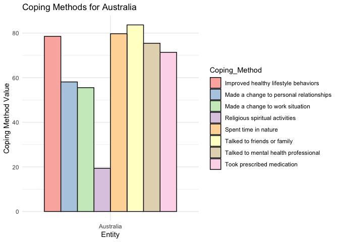

<!-- README.md is generated from README.Rmd. Please edit that file -->

# copingmethods

<!-- badges: start -->
<!-- badges: end -->

The goal of copingmethods is to provide data about the various coping
methods adapted by countries to deal with depression and anxiety in
2020.

## Installation

You can install the development version of copingmethods from
[GitHub](https://github.com/) with:

``` r
remotes::install_github("ETC5523-2024/assignment-4-packages-and-shiny-apps-praj0022")
```

## Example

This is a basic example which shows you how to solve a common problem:

``` r
library(copingmethods)
library(ggplot2)
library(dplyr)
#> 
#> Attaching package: 'dplyr'
#> The following objects are masked from 'package:stats':
#> 
#>     filter, lag
#> The following objects are masked from 'package:base':
#> 
#>     intersect, setdiff, setequal, union
```

``` r
library(tidyr)


long_data <- percent_copingmethods |>
  pivot_longer(
    cols = -c(Entity, Code, Year),        # Pivot all columns except 'Entity', 'Code' and 'Year'
    names_to = "Coping_Method",           # New column for coping method names
    values_to = "Value"                   # New column for the values of coping methods
  )


# Filter the data to only include rows where Entity is "Australia"
filtered_data <- long_data %>%
  filter(Entity == "Australia")

# Plot using the filtered data with a border around the bars and softer colors
ggplot(filtered_data, aes(x = Entity, y = Value, fill = Coping_Method)) +
  geom_col(position = "dodge", color = "black") +          # Add black border around bars
  scale_fill_brewer(palette = "Pastel1") +                 # Use a soft color palette
  labs(x = "Entity", y = "Coping Method Value", title = "Coping Methods for Australia") +
  theme_minimal()
```


